# Dockerized Web App Deployment on AWS (Docker Swarm + ECR)

A hands-on DevOps project that takes a simple web application from a single Docker container all the way to a scaled, secured, and production-ready deployment using **Docker**, **Docker Swarm**, and **Amazon ECR**.

This project was built as part of my **#AWSDevOpsRestartJourney** — documenting practical, real-world DevOps workflows as I rebuild my hands-on skills.

---

## Project Overview

As a Junior DevOps Engineer, the goal of this project is to take a simple web application provided by the development team and prepare it for **production deployment**. This includes:

- Containerizing the application with Docker
- Configuring persistent storage so data isn't lost
- Pushing images to Amazon ECR (Elastic Container Registry)
- Deploying and scaling the app using Docker Swarm
- Setting up container networking
- Performing vulnerability scanning before going live
- Applying Docker security best practices

Each phase below includes the **goal**, the **exact commands used**, **why each step matters**, and **how to verify it worked** — written so a fellow beginner can follow along without prior Docker/AWS experience.

---

## Tech Stack

| Tool | Purpose |
|------|---------|
| Docker | Containerization |
| Docker Swarm | Orchestration & scaling |
| Amazon ECR | Docker image registry |
| AWS CLI | Authenticating Docker with AWS |
| Trivy | Vulnerability scanning |
| Nginx (alpine) | Lightweight web server base image |
| HTML | Sample web application |

---

## Prerequisites

Before starting, make sure you have:

- An Ubuntu EC2 instance (`t3.small` or higher)
- Security Group with **port 8080 open** for inbound traffic (to access the app from browser)
- Docker installed and running (`docker --version`)
- An AWS account with an IAM user that has ECR permissions
- AWS CLI installed and configured (`aws configure`)
- Basic command line familiarity (cd, mkdir, nano/vim)

---

## Step-by-Step Implementation

### Phase 1: Application Containerization

**Goal:** Package a simple web app into a Docker image, run it as a container, and confirm it's accessible from a browser.

**Step 1 — Create the project folder and web page**

```bash
mkdir docker-aws-deployment && cd docker-aws-deployment
mkdir app && cd app
```

Created a simple `index.html` file:

```html
<!DOCTYPE html>
<html>
<head>
  <title>My DevOps App</title>
</head>
<body>
  <h1>Welcome to my Dockerized Web App!</h1>
  <p>Version: 1.0</p>
</body>
</html>
```

**Step 2 — Write the Dockerfile**

Went back to the project root and created a `Dockerfile`:

```dockerfile
# Use a lightweight, official Nginx image as the base
FROM nginx:alpine

# Copy our web page into Nginx's default serving directory
COPY app/index.html /usr/share/nginx/html/index.html

# Document that the container listens on port 80
EXPOSE 80

# Start Nginx in the foreground (required for Docker containers)
CMD ["nginx", "-g", "daemon off;"]
```

> **Why Nginx Alpine?** Alpine-based images are tiny (~5-7MB) compared to full OS images (~100MB+), which means faster builds, faster pulls, and a smaller attack surface.

**Step 3 — Build the Docker image**

```bash
docker build -t myapp:v1 .
```

This reads the Dockerfile, pulls the base image, copies in the HTML file, and tags the resulting image as `myapp:v1`.

**Step 4 — Run the container**

```bash
docker run -d -p 8080:80 --name myapp-container myapp:v1
```

- `-d` → run in detached (background) mode
- `-p 8080:80` → map port 8080 on the host to port 80 inside the container
- `--name` → gives the container a friendly name for easier management

**Step 5 — Verify it's running**

```bash
docker ps
```

You should see `myapp-container` listed with status `Up`.

**Step 6 — Verify in the browser**

Opened `http://localhost:8080` or `http://<public-ip-ec2>:8080`in a browser and confirmed the "Welcome to my Dockerized Web App!" message displayed correctly.

📸 **Screenshot:** Container running (`docker ps` output)
> 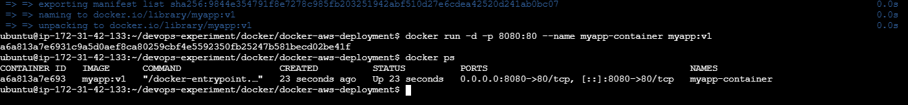

📸 **Screenshot:** App accessible in browser
> 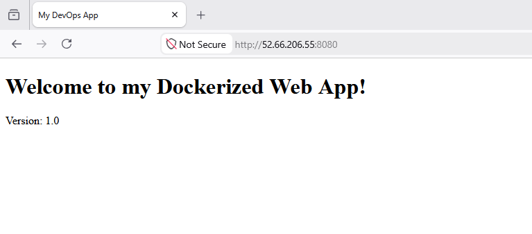

---

### Phase 2: Docker Networking

**Goal:** Understand how containers discover and communicate with each other, and how Bridge mode differs from Host mode.

**Step 1 — Create a custom bridge network**

```bash
docker network create my-bridge-net
```

By default, Docker has a built-in bridge network, but creating a **custom** one allows containers to resolve each other **by container name** (DNS-based discovery), which the default bridge doesn't support.

**Step 2 — Deploy two containers on that network**

```bash
docker run -d --name container-a --network my-bridge-net myapp:v1
docker run -d --name container-b --network my-bridge-net myapp:v1
```

**Step 3 — Verify container-to-container communication**

Opened a shell inside `container-a` and pinged `container-b` by name:

```bash
docker exec -it container-a sh
ping container-b
curl http://container-b:80
```

Both succeeded — confirming that containers on the same custom bridge network can reach each other using just their container name (no IP address needed).
📸 **Screenshot:** Container-to-container communication test (ping/curl success)
> 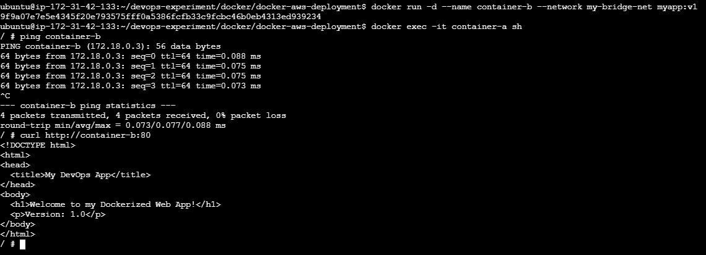

**Step 4 — Explore Host Network mode**

```bash
docker run -d --network host --name myapp-host myapp:v1
```

In host mode, the container shares the host machine's network stack directly — there's no port mapping (`-p`) needed because the container uses the host's ports directly.

**Step 5 — Compare Bridge vs Host**

| Network Type | Isolation | Port Mapping Needed? | Use Case |
|---------------|-----------|------------------------|----------|
| **Bridge (custom)** | Isolated; containers reach each other by name | Yes (`-p`) | Default choice — most multi-container apps |
| **Host** | None — shares host's network stack | No | Performance-critical apps; not recommended when isolation/security matters |


📸 **Screenshot:** Container running in Host network mode
> 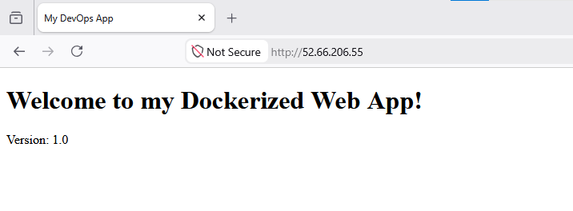

---

### Phase 3: Persistent Storage

**Goal:** Prevent data loss when a container is removed, and understand the difference between Named Volumes and Bind Mounts.

**Step 1 — Create a named volume**

```bash
docker volume create app-data
```

**Step 2 — Attach the volume to a container**

```bash
docker run -d --name myapp-storage -v app-data:/usr/share/nginx/html myapp:v1
```

This mounts the `app-data` volume to the folder Nginx serves files from.

**Step 3 — Write test data and verify persistence**

```bash
docker exec -it myapp-storage sh 
  echo 'Hello test' > /usr/share/nginx/html/test.txt
  exit

docker rm -f myapp-storage
docker run -d --name myapp-storage-2 -v app-data:/usr/share/nginx/html myapp:v1
docker exec -it myapp-storage-2 sh
  cat /usr/share/nginx/html/test.txt
  exit
```

Even though the **original container was deleted**, the new container (using the same named volume) could still read `test.txt` — proving the data survived independently of the container's lifecycle.

📸 **Screenshot:** Data persisting after container deletion
> 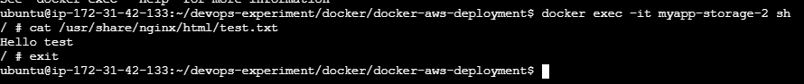

**Step 4 — Create and test a Bind Mount**

```bash
mkdir ~/bind-data
docker run -d --name myapp-bind -v ~/bind-data:/usr/share/nginx/html myapp:v1
docker exec -it myapp-bind sh
  cd /usr/share/nginx/html
  echo 'Created from the container for bind' > container-file-bind.txt
  exit
cat ~/bind-data/container-file-bind.txt
```

A bind mount maps a specific folder **on the host machine** directly into the container, so changes are visible instantly on both sides.

📸 **Screenshot:** Bind mount in action
> 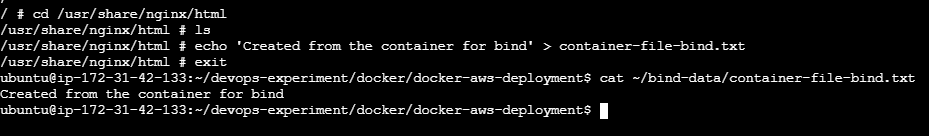

**Step 5 — Compare Named Volumes vs Bind Mounts**

| Storage Type | Managed By | Location | Best For |
|----------------|-------------|-----------|----------|
| **Named Volume** | Docker | Docker's internal storage area | Production data persistence; portable across hosts |
| **Bind Mount** | User/Host filesystem | Any path you choose on the host | Local development; direct file editing/debugging |

---

### Phase 4: Amazon ECR Integration

**Goal:** Store the Docker image in AWS so it can be pulled from anywhere (e.g., Swarm nodes, EC2 instances) instead of relying on a local machine.

**Step 1 — Create an ECR repository**

Via AWS CLI:

```bash
aws ecr create-repository --repository-name myapp --region <your-region>
```

(Can also be done through the AWS Console under **ECR → Create repository**.)

📸 **Screenshot:** ECR repository created
> 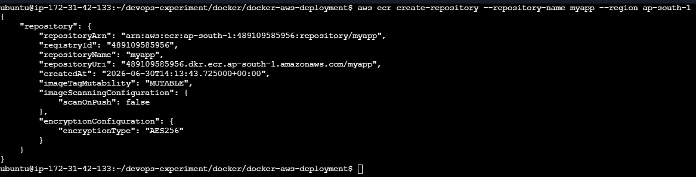
📸 **Screenshot:** ECR repository from aws
> 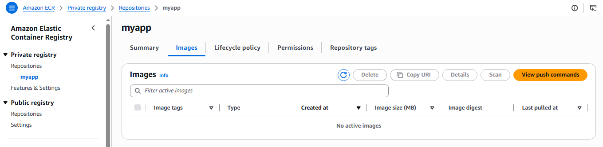

**Step 2 — Authenticate Docker with ECR**

```bash
aws ecr get-login-password --region <your-region> | \
docker login --username AWS --password-stdin <account-id>.dkr.ecr.<your-region>.amazonaws.com
```
You will see a message 'Login Succeeded'
This generates a temporary auth token and logs Docker into the private ECR registry tied to your AWS account.

**Step 3 — Tag the image for ECR**

```bash
docker tag myapp:v1 <account-id>.dkr.ecr.<your-region>.amazonaws.com/myapp:v1
```

📸 **Screenshot:** Image successfully pushed to ECR
> 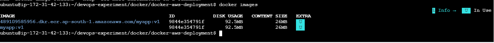

ECR requires the image tag to be prefixed with the full registry URI so Docker knows where to push it.

**Step 4 — Push the image to ECR**

```bash
docker push <account-id>.dkr.ecr.<your-region>.amazonaws.com/myapp:v1
```

**Step 5 — Verify the image is in ECR**

```bash
aws ecr describe-images --repository-name myapp --region <your-region>
```
📸 **Screenshot:** Image successfully pushed status
> 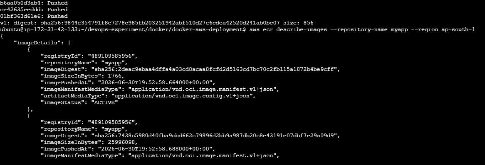

Also confirmed visually in the AWS Console under the `myapp` repository.

📸 **Screenshot:** Image successfully pushed to ECR
> 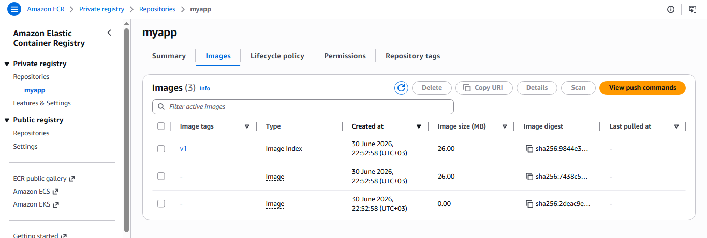

---

### Phase 5: Docker Swarm Cluster Setup

**Goal:** Learn basic container orchestration concepts by initializing a Swarm cluster.

**Step 1 — Initialize Swarm mode**

```bash
docker swarm init --advertise-addr <manager-ip>
```

This turns the current machine into a **Swarm Manager** node.

📸 **Screenshot:** Swarm initialized successfully
> 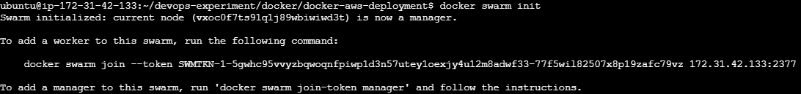

**Step 2 — Understand Manager vs Worker roles**

List all nodes in the swarm and their roles

```bash
docker node ls
```

📸 **Screenshot:** node list
> 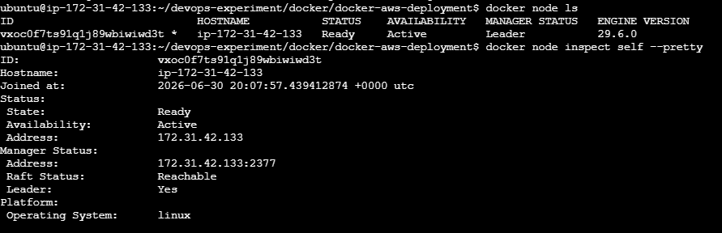

The * means this is the node you're currently on
MANAGER STATUS: Leader confirms it's the manager node

So with a single machine, **both roles run on the same node** — the manager schedules services and the same node also executes them.
 
> A Manager node can also run containers, but in production it's common to keep managers dedicated to orchestration and let workers handle the workload.
> In this case taken 

**Step 3 — Generate the worker join token**

If you have a second machine — join it as a Worker:
Run this on the MANAGER to get the join command

```bash
docker swarm join-token worker
```

This outputs a `docker swarm join` command (with a security token) that any other machine can run to join the cluster as a worker node.
Copy the output command and run it on the WORKER machine
It looks like this:

```bash
docker swarm join --token SWMTKN-1-xxxxx <manager-ip>:2377
```

📸 **Screenshot:** Swarm initialized successfully
> 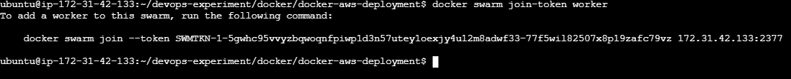

---

### Phase 6: Service Deployment and Scaling

**Goal:** Deploy the app as a Swarm Service (not just a single container) and scale it to handle increased traffic.

**Step 1 — Deploy the app as a Swarm service**

```bash
docker service create --name web-service --replicas 1 -p 8080:80 \
<account-id>.dkr.ecr.<your-region>.amazonaws.com/myapp:v1
```

Unlike `docker run`, a **service** is managed by Swarm — if the container crashes or a node goes down, Swarm automatically reschedules it.

**Step 2 — Verify service creation**

```bash
docker service ls
docker service ps web-service
```

**Step 3 — Scale from 1 to 5 replicas**

```bash
docker service scale web-service=5
```

**Step 4 — Observe task distribution**

```bash
docker service ps web-service
```

This showed all 5 replicas, which node each was running on, and their current state — demonstrating how Swarm spreads load across available nodes automatically.

📸 **Screenshot:** Service created and running
> 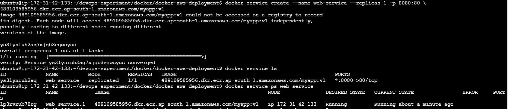

📸 **Screenshot:** Service scaled to 5 replicas with task distribution
> 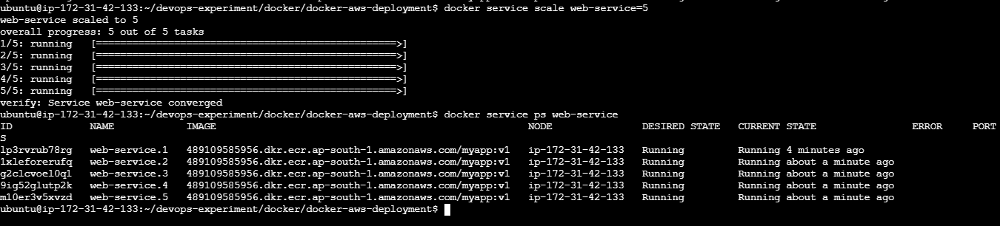

---

### Phase 7: Rolling Updates

**Goal:** Update a live application to a new version with minimal downtime.

**Step 1 — Create Version 2 of the app**

Update app/index.html

```html
<!-- index-v2.html -->
<!DOCTYPE html>
<html>
<head>
  <title>My DevOps App</title>
</head>
<body>
  <h1>Hello from my Dockerized Web App!</h1>
  <p>Version: 2.0 is Updated!</p>
</body>
</html>
```

**Step 2 — Build and push the new image**

```bash
docker build -t myapp:v2 .
docker tag myapp:v2 <account-id>.dkr.ecr.<your-region>.amazonaws.com/myapp:v2
docker push <account-id>.dkr.ecr.<your-region>.amazonaws.com/myapp:v2
```

**Step 3 — Update the running service**

```bash
docker service update \
  --image <account-id>.dkr.ecr.<your-region>.amazonaws.com/myapp:v2 \
  --update-parallelism 1 \
  --update-delay 10s \
  web-service
```

- `--update-parallelism 1` → update one replica at a time
- `--update-delay 10s` → wait 10 seconds between each replica update

📸 **Screenshot:** Rolling update in progress
> 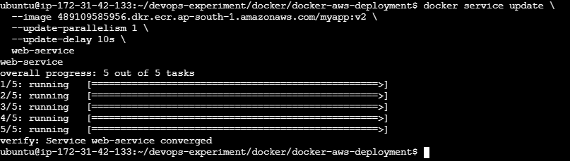

**Step 4 — Observe the rolling update**

```bash
docker service ps web-service
```

Watched replicas get replaced **one at a time** — old containers shut down only after new ones came up healthy, so the app stayed available throughout the update (no full outage).

📸 **Screenshot:** Service status
> 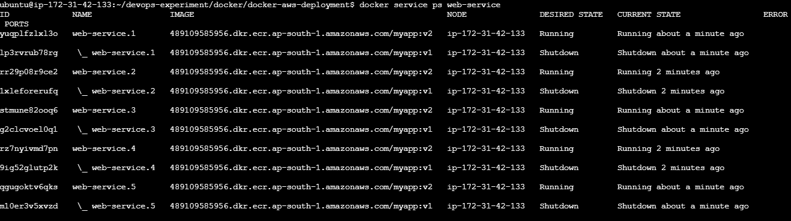

**Step 5 — Verify v2 is live in the browser**
 
Open your browser and go to:
 
```
http://<your-ec2-public-ip>:8080
```
 
📸 **Screenshot:** You should now see the updated page:
> 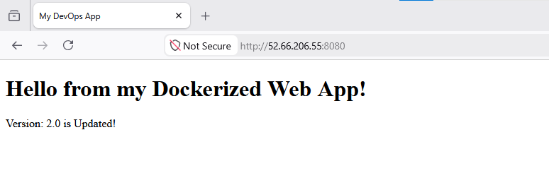

---

### Phase 8: Security Scanning with Trivy

**Goal:** Catch known vulnerabilities in the image before it goes anywhere near production.

**Step 1 — Install Trivy**

```bash
sudo apt-get install trivy  # Linux (after adding Trivy's apt repo)
```

**Step 2 — Scan the Docker image**

```bash
trivy image myapp:v1
```

**Step 3 — Identify HIGH and CRITICAL vulnerabilities**

```bash
trivy image --severity HIGH,CRITICAL myapp:v1
```

This filters the (often long) results down to only the issues worth prioritizing immediately.

📸 **Screenshot:** Trivy scan results (HIGH/CRITICAL findings)
> 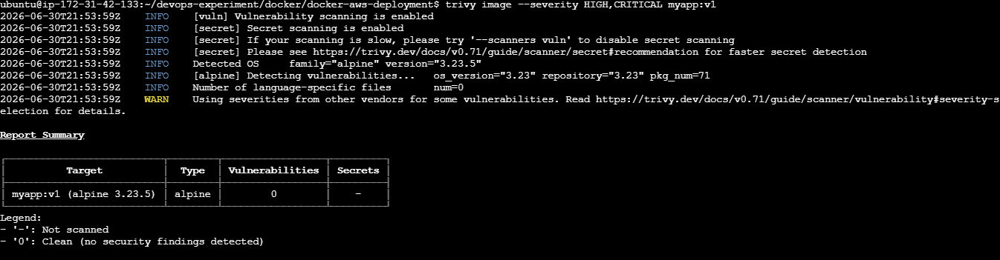

**Step 4 — Research selected CVEs**

From the Trivy scan output, pick 2-3 CVEs listed as HIGH or CRITICAL and research each one:
 
1. Copy the CVE ID from the Trivy output (e.g. `CVE-2023-44487`)
2. Search it on [https://nvd.nist.gov](https://nvd.nist.gov) to read what it does and its CVSS severity score
3. Check the `FIXED VERSION` column in Trivy — if available, upgrade the base image to get the fix
4. Check if it's actively exploited in the wild at [https://www.cisa.gov/known-exploited-vulnerabilities-catalog](https://www.cisa.gov/known-exploited-vulnerabilities-catalog)

📸 **Screenshot:** Trivy scan results
> 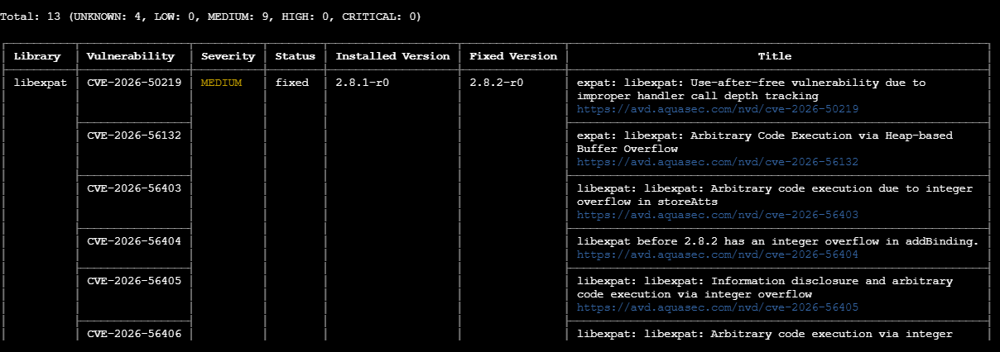

---

### Phase 9: ECR Image Scanning

**Goal:** Use AWS-native scanning as a second, independent layer of vulnerability detection.

**Step 1 — Enable Scan on Push**

In the ECR Console → repository → **Edit** → enabled **"Scan on push."**
(Or via CLI when creating the repo: `--image-scanning-configuration scanOnPush=true`)

📸 **Screenshot:** ECR scan on push settings
> 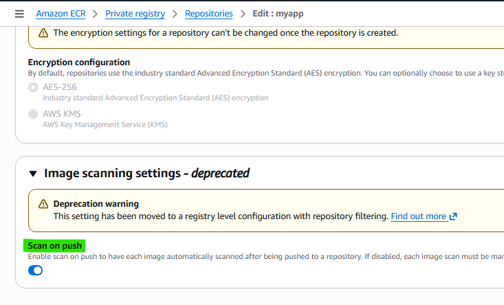

**Step 2 — Push the image to trigger the scan**

> **Note:** ECR Basic Scanning does not support **Image Index** type images (multi-platform manifests) or images with **SBOM/provenance attestations** enabled. If your image was pushed with these settings (default in newer Docker versions), the scan will fail with an `UnsupportedImageTypeException` error. Fix it by rebuilding and pushing with SBOM and provenance disabled:
>
> ```bash
> # Rebuild as a single-platform image with SBOM and provenance disabled
> docker build --platform linux/amd64 --provenance=false --sbom=false -t myapp:v1-scan .
>
> # Tag and push the corrected image
> docker tag myapp:v1-scan <account-id>.dkr.ecr.<your-region>.amazonaws.com/myapp:v1-scan
> docker push <account-id>.dkr.ecr.<your-region>.amazonaws.com/myapp:v1-scan
> ```
>
> The new image will show as type **Image** (not **Image Index**) in ECR — which Basic Scanning supports.

```bash
docker push <account-id>.dkr.ecr.<your-region>.amazonaws.com/myapp:v1
```

**Step 3 — Review scan findings**

```bash
aws ecr describe-image-scan-findings --repository-name myapp --image-id imageTag=v1
```

📸 **Screenshot:** ECR scan results
> 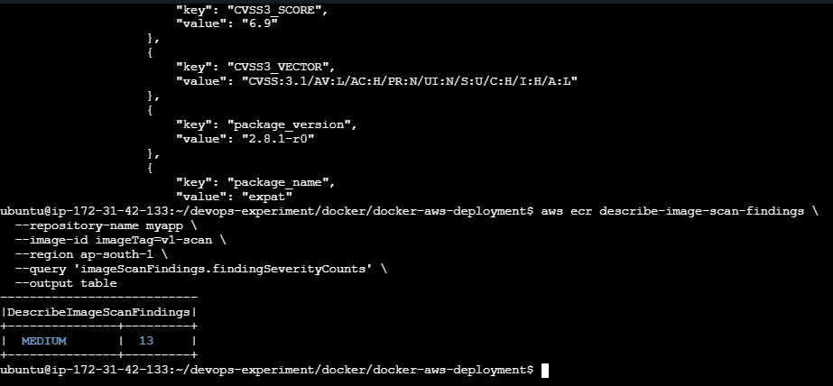

Also reviewed the findings visually in the ECR Console under the image's **"Vulnerabilities"** tab.

**Step 4 — Compare ECR findings with Trivy findings**

| | Trivy | ECR Scanning |
|---|-------|----------------|
| Runs where | Locally / CI pipeline | Inside AWS, on push |
| Database | Trivy's own vulnerability DB | Amazon's (Clair-based / Inspector) |
| Speed | Fast, immediate | Takes a minute or two after push |
| Best for | Pre-push checks, shift-left security | Continuous, AWS-native compliance checks |

Both tools flagged a largely overlapping set of issues, which gave confidence in the results — using two independent scanners is a good practice rather than relying on just one.

📸 **Screenshot:** ECR scan results from aws console
> 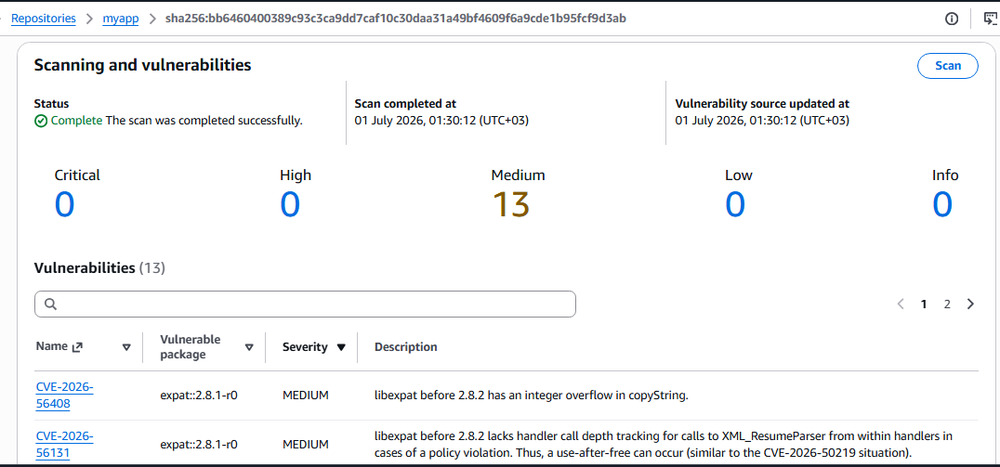

---

### Phase 10: Docker Security Best Practices

**Goal:** Apply production-grade hardening to the Dockerfile and image.

**1. Optimize Dockerfile using layer caching**

**1. Optimize Dockerfile using layer caching**
 
Ordered instructions so things that change rarely (like installing dependencies) come **before** things that change often (like copying app code). This way, Docker can reuse cached layers and skip re-running unchanged steps on every build.
 
In our project, the optimized `Dockerfile` looks like this:
 
```dockerfile
FROM nginx:alpine
 
# Copy config/dependencies first (rarely changes — Docker caches this layer)
COPY nginx.conf /etc/nginx/nginx.conf
 
# Copy app code last (changes most frequently — only this layer rebuilds)
COPY app/index.html /usr/share/nginx/html/index.html
 
EXPOSE 80
CMD ["nginx", "-g", "daemon off;"]
```
 
Create a sample nginx.conf
Build and observe caching in action:
 
```bash
# First build — all layers are built fresh
docker build -t myapp:v1 .
 
# Make a small change to index.html, then rebuild
docker build -t myapp:v1 .
```
 
On the second build you'll see `CACHED` next to layers that didn't change — Docker skipped re-running them, making the build faster.

📸 **Screenshot:** Optimize Dockerfile using layer caching
> 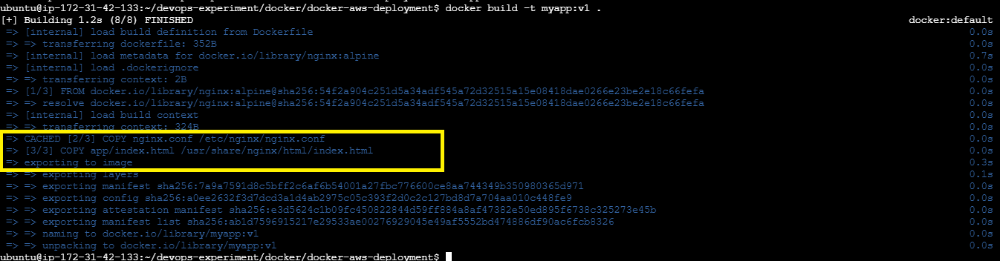

**2. Use a minimal base image**

Chose `nginx:alpine` instead of a full `nginx:latest` (Debian-based) image — smaller size means fewer installed packages, which means a smaller attack surface and faster deploys.

**3. Create and use a non-root user**

```dockerfile
FROM nginx:alpine

# Create a dedicated non-root user/group
RUN addgroup -S appgroup && adduser -S appuser -G appgroup

COPY app/index.html /usr/share/nginx/html/index.html

# Switch to the non-root user before running the app
USER appuser

EXPOSE 80
CMD ["nginx", "-g", "daemon off;"]
```

**4. Why running containers as root is dangerous**

If a container runs as root and an attacker manages to break out of it (a "container escape"), they could gain **root-level access to the underlying host system** — not just the container. Running as a non-root user limits the damage an attacker can do even if they compromise the application inside the container.

**5. Researched multi-stage builds**

Multi-stage builds use multiple `FROM` statements in one Dockerfile — one stage to **build/compile** the app (with all the heavy build tools), and a final, separate stage that only copies the finished output into a clean, minimal image:

Below is sample multistage Dockerfile:
```dockerfile
# ---- Build stage ----
FROM node:20 AS builder
WORKDIR /app
COPY . .
RUN npm install && npm run build

# ---- Final stage ----
FROM nginx:alpine
COPY --from=builder /app/dist /usr/share/nginx/html
USER appuser
EXPOSE 80
CMD ["nginx", "-g", "daemon off;"]
```

The final image only contains the static build output and Nginx — none of the Node.js build tools or source files, which keeps the image small and reduces what an attacker could find or exploit.

**Check and compare image sizes:**
 
```bash
docker build -t myapp:v1 .
# List all myapp images with their sizes
docker images myapp
```
 
You can clearly see how using `nginx:alpine` as the base keeps the image around **26MB** — compared to `nginx:latest` (Debian-based) which would be around **180MB+**.
 
```bash
# To compare, pull the full nginx image and check the size difference
docker pull nginx:latest
docker images nginx
```
 
📸 **Screenshot:** Image size comparison (`docker images` output)
> 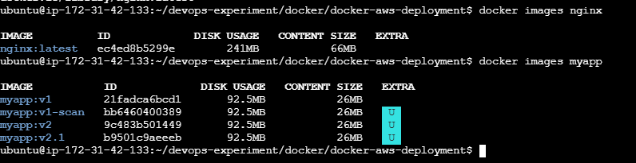
 
---

## ✅ Key Takeaways

- Docker simplifies packaging and running applications consistently across environments.
- Docker Swarm provides simple, built-in orchestration for scaling and rolling updates.
- Persistent storage strategy matters — choose named volumes for production, bind mounts for local dev.
- Custom bridge networks make container-to-container communication simple via DNS name resolution.
- Security isn't optional — scanning images with both Trivy and ECR, and following best practices like non-root users, minimal base images, and multi-stage builds, are essential before production deployment.

---

Connect with me as I continue this journey: **#AWSDevOpsRestartJourney**
